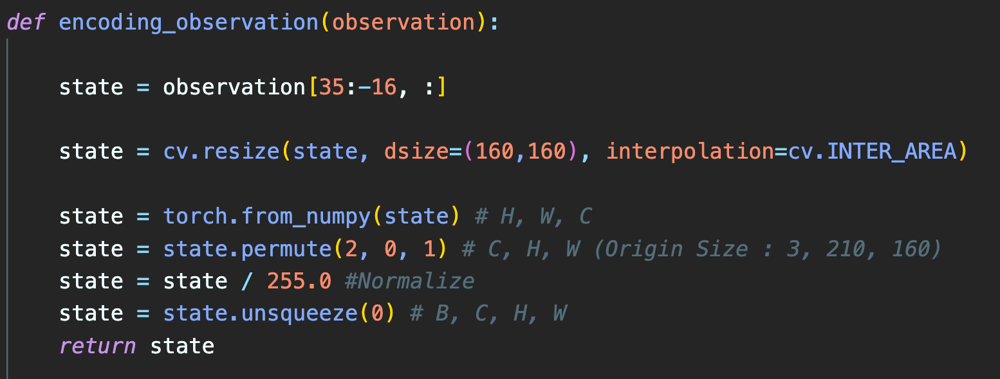

# KAU-Reinforcement Learning Project
## OpenAi GYM A3C

### 1. Project Overview
OpenAi GYM 환경을 이용하여 Atari game 중, Pong, SpaceInvaders game을 A3C를 통해 학습 

### 2. A3C를 위한 Async 환경 설정
2-1) Process 공유 Model 설정  
Process간 공유하는 Main이 되는 Model을 선언 후, torch의 neural network module 에서 제공하는 share_memory() 함수를 이용해 Process간 공유되는 모델로 변경  

2-2) Multi Processing  
python multiprocessing module의 Process 사용. - 총 8개의 Process를 통해 학습  

train 함수를 각 Process별로 실행  

### 3. Observation / State Representation
Observation은 env의 step() 함수를 통해 return되는 observation 값을 이용  
Observation은 3 x 210 x 160 의 Image로 return됨  

Observation을 State로 그대로 사용하기엔 상황마다 변하는 점수표와 위 아래의 테두리와 같이 State에 필요하지 않은 정보가 많기 때문에 제외.  

hand-craft로 위쪽 35번째 pixel부터 사용, 아래쪽 15개의 pixel은 제외하여 state로 정의. 0~255의 값을 가지는 pixel 값을 0 ~ 1의 값을 가지도록 Normalization을 진행. 크기는 160 x 160 의 사이즈를 갖도록 resize하여 고정.  

Basic Model의 경우 1개의 State만을 Model의 인풋으로 사용. 대신 Model 내부에서 GRUCell을 이용하여 n개의 State를 보는 효과를 가져 옴.  

4개의 State를 Concat하여 Model의 인풋으로도 사용. 아래 8. Result 를 통해 비교  

### 4. Model
Basic Model  (1 State Input)  

4 State Model (4 State Input)
Queue를 이용하여 최근 4개의 State를 Concat하여 모델의 Input으로 사용.

변경 점
기존의 3->8->16-> ... channel로 늘어나는 convolution layer를, 12(3*4)->16->16-> ... 로 진행. 맨 처음의 3->8과 12->16을 제외하면 동일.  

### 5. Training
자신의 모델을 선언 후, share Main Model의 Parameter를 덮어 씀.  

Optimizer(Adam 사용)에 share memory parameter를 넣어둠으로써 모든 Process에서 main model을 업데이트 할 수 있도록 optimizer를 선언.  
  

모든 Inference는 자신의 모델을 통해 진행.  

State가 network를 지나 Output으로 된 policy output을 softmax를 통해 probability로 변경.  
torch.multinomial() 함수를 이용하여 1개를 sampling하여 action으로 사용  
30 step에 1번씩 자신의 모델을 backward하여 gradient를 계산.  
그 후 해당 gradient를 share main model에 넘겨주고 optimizer를 통해 update.

다시 main model의 파라미터를 자신의 모델에 덮어쓰고 학습을 진행.

### 6. Loss
초록 선) Value Loss를 구할 때 사용한 R-V()는 A3C의 advance의 역할인 value로 취급.  
파란 선) Policy Loss를 구할 때 사용한 R-V()는 Q-Value로 취급하여 사용.  
같은 R-V()의 값이지만 다르게 해석.  

다음과 같이 loss를 구한 뒤,  

ensure_shared_grads function -> 1K star를 받은 A3C 코드에서 제공.  
https://github.com/ikostrikov/pytorch-a3c/blob/master/train.py

각 Process의 model에서 생성된 gradient를 shared하고 있는 main model에 넘겨주는 function.  

optimizer는 shared_model의 parameter에 접근하고 있기 때문에 step()을 통해 update를 하면 main model의 parameter가 업데이트 됨. 

### 7. Validation
python 파일을 실행시킨 Main Process는 main thread.py를 실행하며, rendering 및 main model을 이용한 결과를 확인함.  

train에서와는 다르게 torch의 multinomial 함수를 통해 action을 sampling하지 않고, 가장 확률이 높은 action을 하도록 max를 취하여 action을 선택.  

한 에피소드가 종료 되었을 경우 main model의 parameter를 자신의 model에 불러 학습 진행을 확인.

### 8. Result
### Pong  
학습 Parameter:  
  

Reward : 
점수를 잃었을 때 : -1  
점수를 얻었을 때 : +1  
  
Wandb Reward Graph:  
  

### State에 따른 성적 변화  
위의 그래프 중, 빨간 그래프는 1개의 이미지를 State로 사용한 경우,  
파란 그래프는 4개의 이미지를 concat하여 State로 사용한 경우이다.  

그래프를 보면 초기에는 파란 그래프가 학습을 잘 못하는 것처럼 보이지만   
결국 나중에 승리를 하도록 학습이 빠르게 이루어지는 경우는 파란 그래프, 4장의 Image를 concat한 State를 가졌을 때이다.  

이를 통해 State Representation이 정확하고 많은 정보를 담을수록 RL의 학습이 정확해지고 빨라지는 것을 알 수 있다.  

### 학습 화면  
### Training 초기  
구석에서 암것도 안함  

### 30분 ~  
  

### 1시간 ~  
움직이면서 슬슬 침  
  

### 2시간 ~  
점수를 많이 따기 시작  
  

### 최종 (3~4시간 이상 학습)  
승리  
  

3시간 ~ 큰 점수차로 승리  
  
  
### Space Invaders  
학습 Parameter:  
  

Reward :  
적을 처리했을 때 : +0.1  
목숨을 잃었을 때 : -1  
  
Wandb Reward Graph:  
  
reward가 시간이 지남에 따라 상승하는 모습